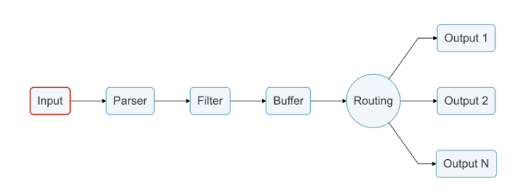

# puppet-fluentbit [](https://forge.puppet.com/modules/deric/fluentbit) [](https://github.com/deric/puppet-fluentbit/actions/workflows/test.yml)

A Puppet module to manage [Fluent Bit](https://fluentbit.io/) installation.

## Description

Fluent Bit is a fast, lightweight agent for trasporting logs, metrics, traces, etc.

In order to install the package and setup `fluent-bit` service, simply include the main class:

```puppet
include fluentbit
```

## Usage

[Fluent Bit supports wide range of inputs](https://docs.fluentbit.io/manual/pipeline/inputs)



Define some inputs:
```yaml
fluentbit::inputs:
  'tail-syslog':
    plugin: tail
    properties:
      Path: /var/syslog
```

[outputs](https://docs.fluentbit.io/manual/pipeline/outputs):
```yaml
fluentbit::outputs:
  'prometheus':
    plugin: prometheus_exporter
    properties:
      match: nginx.metrics.*
      host: 0.0.0.0
      port: 2021
```


### Acceptance tests

```
BEAKER_destroy=no BEAKER_setfile=debian11-64 bundle exec rake beaker
```
